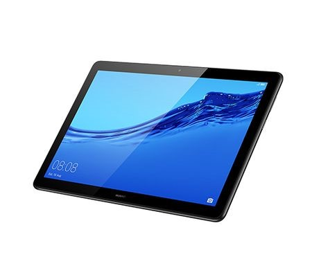

PRESENTATION DES EQUIPEMENTS
++++++++++++++++++++++++++++

Le serveur local
++++++++++++++++
Un PC ayant les caractéristiques minimales suivantes :
    * Processeur: Intel Core i5 CPU 2.30 Ghz
    * RAM : 8 Go
    * Système : Windows 10 64 bits avec Environnement virtuel Ubuntu dans VMware
    * Espace disque : 300 Go

Il assure le rôle de serveur dans le processus de délivrance sécurisé de vignette de visites 
techniques. C’est lui qui abrite l’application de contrôle technique DITROS CT

Le banc de test
+++++++++++++++
Cet équipement physique permet de réaliser un ou plusieurs tests de contrôle technique d’un 
véhicule. Les résultats des tests seront automatiquement transmis au serveur au travers du 
protocole GIEGLAN.

L'imprimante
++++++++++++
C’est l’équipement qui permet de faire les impressions des Procès-verbaux, recto verso et en couleur.

La tablette
+++++++++++
C’est un appareil mobile équipé d’un système d’exploitation Android qui va permettre de faire les tests visuels notamment la prise des photos et les défauts visuels

Le papier du procès verbal
++++++++++++++++++++++++++
Formulaire pré-imprimé fournie sur lesquels sont inscrites les informations du contrôle technique d’un véhicule et qui comprend une vignette prédécoupée et pré-adhésivée.

Les lignes de test
++++++++++++++++++
Ensemble des équipements par lesquels un véhicule passe pour la réalisation de sa visite technique (ripage, suspension, freinage, pollution, règle phare, jeux de plaques, sous-sol ou Cric).