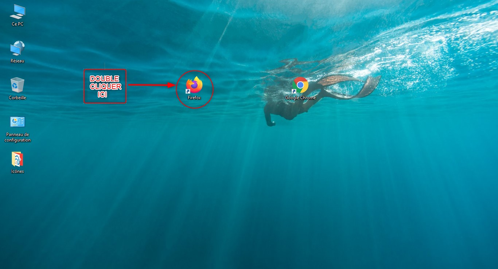
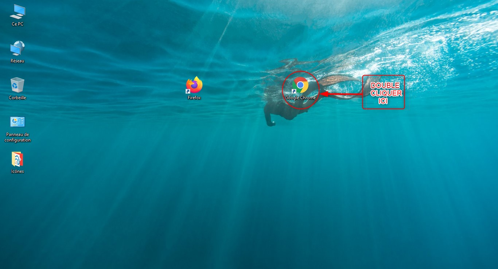
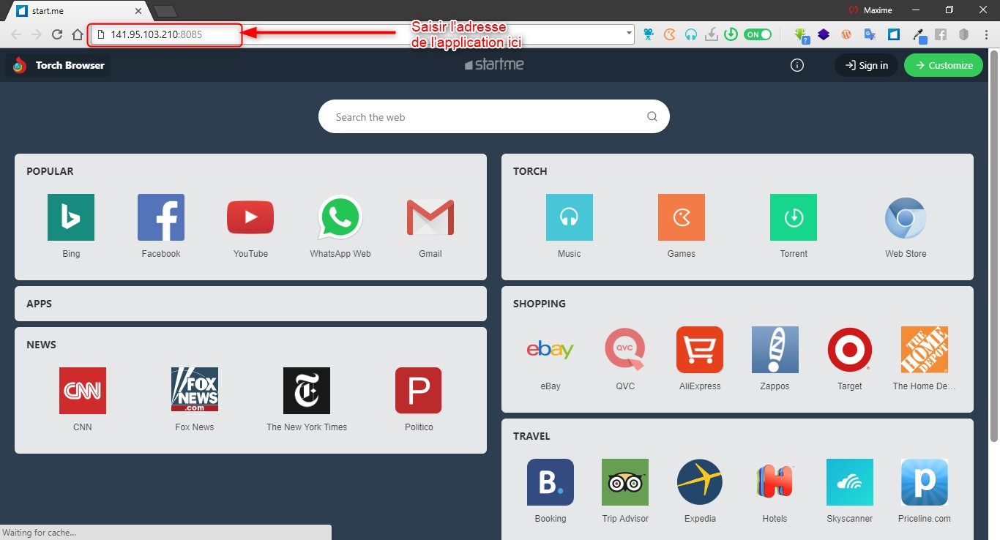
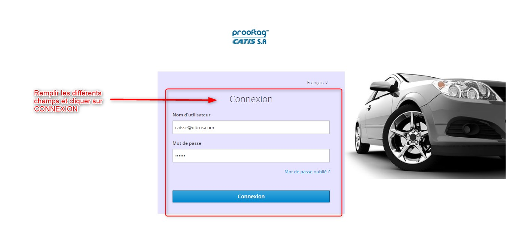

Connexion à l’application web DITROS CT
+++++++++++++++++++++++++++++++++++++++
Ouvrir un navigateur sur votre ordinateur
Il est conseillé de choisir de préférence les navigateurs Firefox ou Google Chrome.

Icône du navigateur Mozilla Firefox

Icône du navigateur google chrome

Entrer l’adresse IP du serveur dans la barre de recherche du navigateur
Sur la barre de recherche, entrer l’adresse IP du serveur. Dans notre cas, c’est l’adresse « **141.95.103.210:8085** ». Puis appuyer la touche « entrer » du clavier

Renseigner vos paramètres de connexion (identifiant et mot de passe)
^^^^^^^^^^^^^^^^^^^^^^^^^^^^^^^^^^^^^^^^^^^^^^^^^^^^^^^^^^^^^^^^^^^^
Vous avez en face de vous une interface de connexion. Renseignez vos paramètres de connexion :
    * Votre identifiant
    * Votre mot de passe

Puis cliquer sur **« CONNEXION »**.

