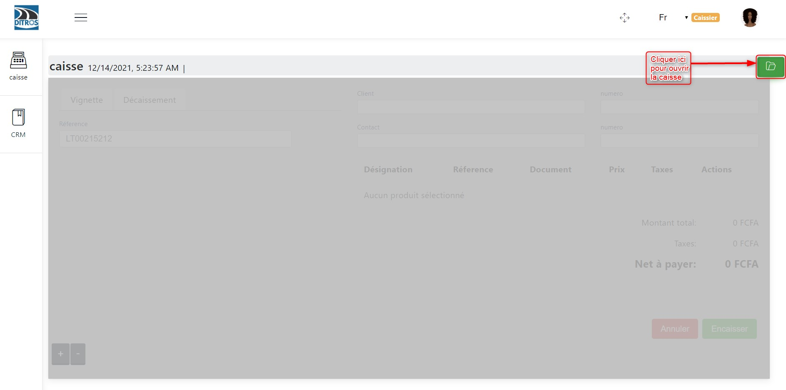

Enregistrement d’un véhicule
============================
Le diagramme ci-dessous présente la section enregistrement d’un véhicule et les différentes opérations qui y sont effectués.

Se connecter à un compte ayant le rôle caisse
^^^^^^^^^^^^^^^^^^^^^^^^^^^^^^^^^^^^^^^^^^^^^
Ici, vous devez vous connecter avec un compte ayant les droits de caisse. Voir **Error: Reference source not found**.

Ouverture de la caisse
^^^^^^^^^^^^^^^^^^^^^^
Une fois connecté à un compte ayant le rôle de caisse, il faut procéder à **l’ouverture de la caisse** en saisissant le montant initial en possession à l’instant où l’on commence les enregistrements.

Saisir le montant initial en caisse à l’instant de l’ouverture de la caisse

Une fois la caisse ouverte, nous avons cette interface avant de commencer les enregistrements il faut afficher les catégories de véhicules et  ajouter un onglet

Remplir les champs
^^^^^^^^^^^^^^^^^^
Renseigner les champs suivants à l’aide de la carte grise :
    * *Référence*
    * *Sélectionner l’icône de la catégorie de véhicule correspondante*
    * *Client* 
    * *Numéro de téléphone du client*
    * *Contact*
    * *Numéro de téléphone du contact*
    * *Choisir le type de document qui permet d’effectuer l’enregistrement*
        * *Carte grise*
        * *Certificat d’immatriculation*
        * *CIVIO*
        * *Autre document*

Après avoir remplis les champs, cliquez sur **« Encaisser »**.

Confirmer l’encaissement
^^^^^^^^^^^^^^^^^^^^^^^^

Impression du ticket de paiement
^^^^^^^^^^^^^^^^^^^^^^^^^^^^^^^^
Une fois l’encaissement effectué, on reçoit une notification « encaissement réussi ». On peut à présent imprimer le ticket de paiement.

Réimpression du ticket de paiement
^^^^^^^^^^^^^^^^^^^^^^^^^^^^^^^^^^
Pour cela, il faut :
    * **(1)** Sélectionner le véhicule enregistré
    * **(2)** cliquer sur **« Reimprimer le ticket de paiement » pour l’impression du ticket de caisse**.