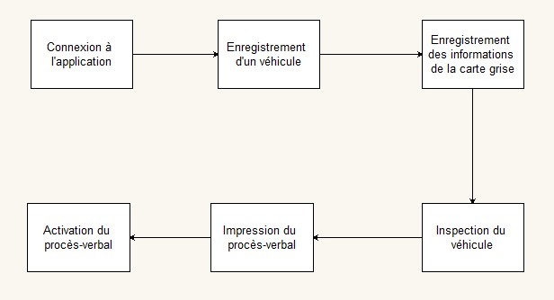
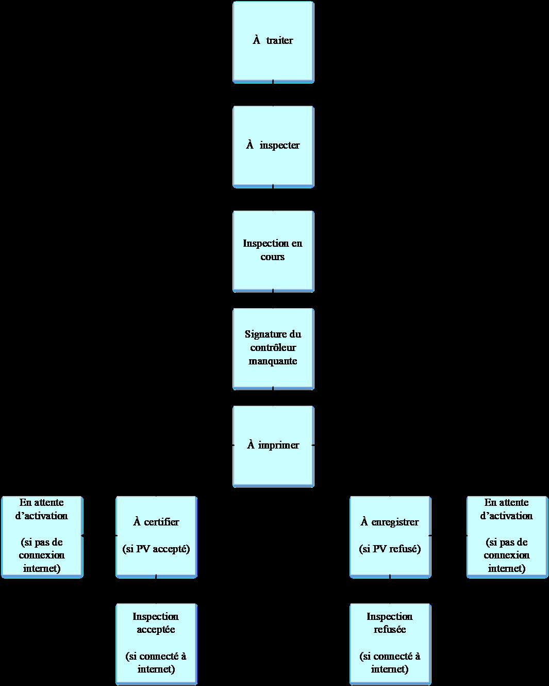

PROCEDURE D’ETABLISSEMENT D’UN PROCES VERBAL POUR UN CONTRÔLE INITIAL
=====================================================================
Le Diagramme ci-dessous présente les différentes étapes d’établissement d’un Procès-verbal (PV) pour un contrôle initial.

Avant de commencer le processus, toujours se rassurer que le serveur, le banc de test, l’ordinateur sur lequel on va se connecter et la tablette sont tous dans le même réseau informatique (filaire ou wifi).

Il est également important de connaitre les différents statuts par lesquels passeront les véhicules enregistrés sur l’application

+------------------------------------------------------------+----------------------------------------------------------------------------------------------------------------------------------------------------------------------------------------------------------------------+
|    Statuts                                                 | Signification                                                                                                                                                                                                        |         
+============================================================+======================================================================================================================================================================================================================+
| 1	A traiter / Màj                                      | Le véhicule est déjà enregistré à la caisse, le compte d’enregistrement des informations de carte grise dois entrer les informations de la carte grise.                                                              |
+------------------------------------------------------------+----------------------------------------------------------------------------------------------------------------------------------------------------------------------------------------------------------------------+
| 2	A inspecter                                          | Les informations de la carte grise sont déjà enregistrées ; le contrôleur doit commencer l’inspection du véhicule.**                                                                                                 |
+------------------------------------------------------------+----------------------------------------------------------------------------------------------------------------------------------------------------------------------------------------------------------------------+
| 3	Inspection en cours                                  | C’est lorsque le contrôleur a déjà lancé l’inspection sur la tablette et le véhicule doit maintenant être passé au contrôle technique sur la ligne de tests correspondantes.                                         |
+------------------------------------------------------------+----------------------------------------------------------------------------------------------------------------------------------------------------------------------------------------------------------------------+
| 4	Signature du contrôleur manquante / A signer         | Le contrôleur doit signer le procès-verbal de contrôle technique du véhicule                                                                                                                                         |
+------------------------------------------------------------+----------------------------------------------------------------------------------------------------------------------------------------------------------------------------------------------------------------------+
| 5	A imprimer                                           | Le PV doit être imprimé par l’exploitation                                                                                                                                                                           |
+------------------------------------------------------------+----------------------------------------------------------------------------------------------------------------------------------------------------------------------------------------------------------------------+
| 6	A certifier                                          |                                                                                                                                                                                                                      |
+------------------------------------------------------------+----------------------------------------------------------------------------------------------------------------------------------------------------------------------------------------------------------------------+
| 7	A enregistrer                                        |                                                                                                                                                                                                                      |
+------------------------------------------------------------+----------------------------------------------------------------------------------------------------------------------------------------------------------------------------------------------------------------------+
| 8	Inspection acceptée                                  |  C’est lorsque l’activation d’une inspection au statut « accepté » est terminée.                                                                                                                                     |
+------------------------------------------------------------+----------------------------------------------------------------------------------------------------------------------------------------------------------------------------------------------------------------------+
| 9	Inspection refusée                                   |  C’est lorsque l’enregistrement d’une inspection au statut « refusé » est terminé.                                                                                                                                   |
+------------------------------------------------------------+----------------------------------------------------------------------------------------------------------------------------------------------------------------------------------------------------------------------+
| 10 En attente d’activation                                 |  Les données ne sont pas encore remontées au niveau du serveur en ligne faute de connexion Internet.                                                                                                                 |
+------------------------------------------------------------+----------------------------------------------------------------------------------------------------------------------------------------------------------------------------------------------------------------------+

Pour produire un PV jusqu’à son activation, suivez les étapes suivantes :

